Term Deposit Classification Problem
================

## Goal

The goal is to predict if a client will subscribe a term deposit.<br> A
term deposit is a cash investment held at a financial institution. The
money is invested for an agreed rate of interest over a fixed amount of
time, or term. It also can be called having a fixed deposit account.

## Breakdown

I will split the process in three. First, i will perform and Exploratory
Data Analysis on the dataset now, then build a machine learning model to
predict if the client would want to subscribe for a term deposit then
build a Web Application for convinence. As the data scientist, i would
really want to focus on the people that will want to subscribe for a
term deposit, knowing the really important factors that influences this
will be my end goal.

## Loading Library and Dataset

``` r
library(tidyverse)


theme_set(ggthemes::theme_gdocs())
```

``` r
bank_df <- read_delim("bank.csv", ";", escape_double = FALSE, trim_ws = TRUE )
```

    ## Parsed with column specification:
    ## cols(
    ##   age = col_double(),
    ##   job = col_character(),
    ##   marital = col_character(),
    ##   education = col_character(),
    ##   default = col_character(),
    ##   balance = col_double(),
    ##   housing = col_character(),
    ##   loan = col_character(),
    ##   contact = col_character(),
    ##   day = col_double(),
    ##   month = col_character(),
    ##   duration = col_double(),
    ##   campaign = col_double(),
    ##   pdays = col_double(),
    ##   previous = col_double(),
    ##   poutcome = col_character(),
    ##   y = col_character()
    ## )

``` r
head(bank_df)
```

    ## # A tibble: 6 x 17
    ##     age job   marital education default balance housing loan  contact   day
    ##   <dbl> <chr> <chr>   <chr>     <chr>     <dbl> <chr>   <chr> <chr>   <dbl>
    ## 1    30 unem~ married primary   no         1787 no      no    cellul~    19
    ## 2    33 serv~ married secondary no         4789 yes     yes   cellul~    11
    ## 3    35 mana~ single  tertiary  no         1350 yes     no    cellul~    16
    ## 4    30 mana~ married tertiary  no         1476 yes     yes   unknown     3
    ## 5    59 blue~ married secondary no            0 yes     no    unknown     5
    ## 6    35 mana~ single  tertiary  no          747 no      no    cellul~    23
    ## # ... with 7 more variables: month <chr>, duration <dbl>, campaign <dbl>,
    ## #   pdays <dbl>, previous <dbl>, poutcome <chr>, y <chr>

## Data Dictionary

<ol>

<li>

age (numeric)

</li>

<li>

job : type of job

</li>

<li>

marital : marital status

</li>

<li>

education

</li>

<li>

default: has credit in default?

</li>

<li>

balance: average yearly balance, in euros (numeric)

</li>

<li>

housing: has housing loan?

</li>

<li>

loan: has personal loan?

</li>

<h5>

Related with the last contact of the current campaign:

</h5>

<li>

contact: contact communication type (categorical:
unknown,telephone,cellular)

</li>

<li>

day: last contact day of the month (numeric)

</li>

<li>

month: last contact month of year

</li>

<li>

duration: last contact duration, in seconds (numeric)

</li>

<h5>

Other attributes:

</h5>

<li>

campaign: number of contacts performed during this campaign and for this
client (numeric, includes last contact)

</li>

<li>

pdays: number of days that passed by after the client was last contacted
from a previous campaign (numeric, -1 means client was not previously
contacted)

</li>

<li>

previous: number of contacts performed before this campaign and for this
client (numeric)

</li>

<li>

poutcome: outcome of the previous marketing campaign (categorical:
unknown,other,failure,success)

</li>

<h5>

Output variable (desired target):

</h5>

<li>

y - has the client subscribed a term deposit? (binary: “yes”,“no”)

</li>

</ol>

## EDA Pipleine

<ul>

<li>

Getting a summary Statistics of our dataset

</li>

<li>

Converting Variables to proper data formats

</li>

<li>

Check for class Imbalance

</li>

<li>

Look at the relationship of the predictors to the target outcomes

</li>

</ul>

## EDA

``` r
bank_df <-  bank_df %>% mutate_if(is.character, factor)
```

``` r
## Smmary Statistics
## Some numeric variables are skewed, Normalization will be required when creating recipe steps
skimr::skim(bank_df)
```

|                                                  |          |
| :----------------------------------------------- | :------- |
| Name                                             | bank\_df |
| Number of rows                                   | 4521     |
| Number of columns                                | 17       |
| \_\_\_\_\_\_\_\_\_\_\_\_\_\_\_\_\_\_\_\_\_\_\_   |          |
| Column type frequency:                           |          |
| factor                                           | 10       |
| numeric                                          | 7        |
| \_\_\_\_\_\_\_\_\_\_\_\_\_\_\_\_\_\_\_\_\_\_\_\_ |          |
| Group variables                                  | None     |

Data summary

**Variable type: factor**

| skim\_variable | n\_missing | complete\_rate | ordered | n\_unique | top\_counts                              |
| :------------- | ---------: | -------------: | :------ | --------: | :--------------------------------------- |
| job            |          0 |              1 | FALSE   |        12 | man: 969, blu: 946, tec: 768, adm: 478   |
| marital        |          0 |              1 | FALSE   |         3 | mar: 2797, sin: 1196, div: 528           |
| education      |          0 |              1 | FALSE   |         4 | sec: 2306, ter: 1350, pri: 678, unk: 187 |
| default        |          0 |              1 | FALSE   |         2 | no: 4445, yes: 76                        |
| housing        |          0 |              1 | FALSE   |         2 | yes: 2559, no: 1962                      |
| loan           |          0 |              1 | FALSE   |         2 | no: 3830, yes: 691                       |
| contact        |          0 |              1 | FALSE   |         3 | cel: 2896, unk: 1324, tel: 301           |
| month          |          0 |              1 | FALSE   |        12 | may: 1398, jul: 706, aug: 633, jun: 531  |
| poutcome       |          0 |              1 | FALSE   |         4 | unk: 3705, fai: 490, oth: 197, suc: 129  |
| y              |          0 |              1 | FALSE   |         2 | no: 4000, yes: 521                       |

**Variable type: numeric**

| skim\_variable | n\_missing | complete\_rate |    mean |      sd |     p0 | p25 | p50 |  p75 |  p100 | hist  |
| :------------- | ---------: | -------------: | ------: | ------: | -----: | --: | --: | ---: | ----: | :---- |
| age            |          0 |              1 |   41.17 |   10.58 |     19 |  33 |  39 |   49 |    87 | ▅▇▅▁▁ |
| balance        |          0 |              1 | 1422.66 | 3009.64 | \-3313 |  69 | 444 | 1480 | 71188 | ▇▁▁▁▁ |
| day            |          0 |              1 |   15.92 |    8.25 |      1 |   9 |  16 |   21 |    31 | ▆▆▇▅▆ |
| duration       |          0 |              1 |  263.96 |  259.86 |      4 | 104 | 185 |  329 |  3025 | ▇▁▁▁▁ |
| campaign       |          0 |              1 |    2.79 |    3.11 |      1 |   1 |   2 |    3 |    50 | ▇▁▁▁▁ |
| pdays          |          0 |              1 |   39.77 |  100.12 |    \-1 | \-1 | \-1 |  \-1 |   871 | ▇▁▁▁▁ |
| previous       |          0 |              1 |    0.54 |    1.69 |      0 |   0 |   0 |    0 |    25 | ▇▁▁▁▁ |

## Test for class imbalance

``` r
## From the summary statistics above, this dataset has class imbalance
## To visualize it.
bank_df %>%
   ggplot(aes(y, fill = y))+
   geom_bar(stat = "count", show.legend = F, col = "black", alpha = 0.9)+
   labs(title = "Test for Class Imbalance",
        subtitle = "It is very obvious, there is a serious class imbalance case here",
        x = NULL,
        y = NULL)
```

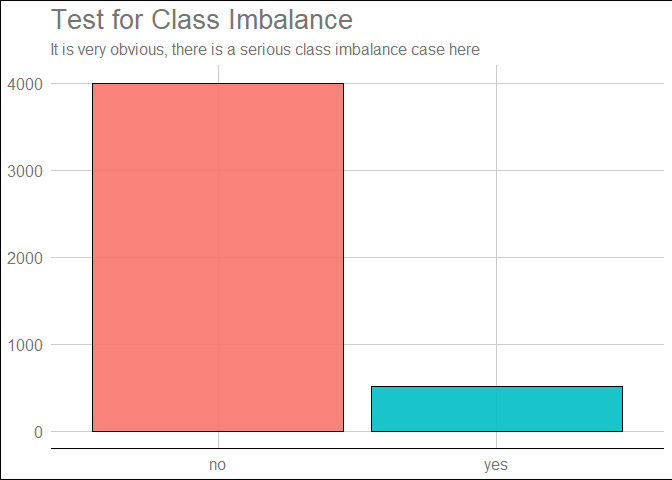<!-- -->

## Comparing Age to Outcome

``` r
## I suspect Older people are more likely to subscribe for a term deposit
## This is a dataset about Fixed Deposit accounts, it makes sense not to see younger age groups
bank_df %>%
   ggplot(aes(age, fill = y))+
   geom_histogram()
```

    ## `stat_bin()` using `bins = 30`. Pick better value with `binwidth`.

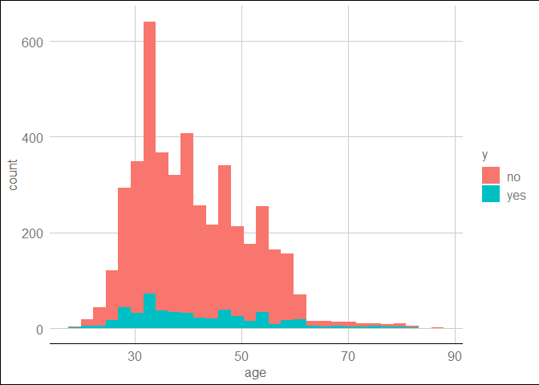<!-- -->

``` r
bank_df %>%
   mutate(age_groups = cut(age, breaks = seq(18, 90, 10), include.lowest = T, right = F)) %>%
   ggplot(aes(age_groups, fill = y))+
   geom_bar(stat = "count")
```

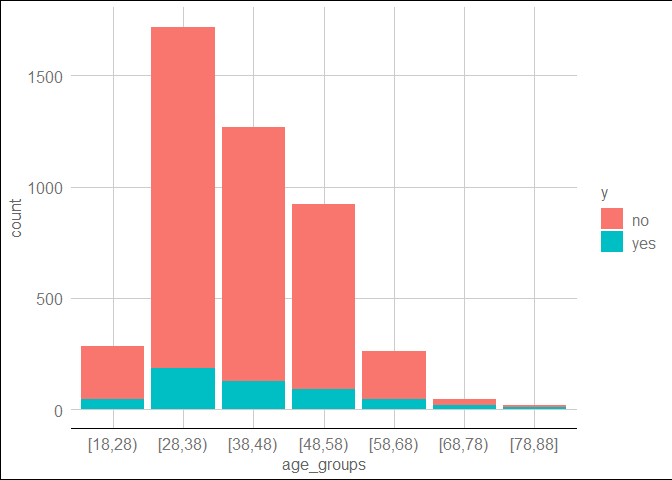<!-- -->

``` r
## Here we see that age ranges from 29-39 has the highest turnout, but is that so?
## Lets look at their ratio plot
## Interest in Term deposit increases with Age
bank_df %>%
   mutate(age_groups = cut(age, breaks = seq(18, 90, 10), include.lowest = T)) %>%
   ggplot(aes(age_groups, fill = y))+
   geom_bar(stat = "count", position = "fill")+
   scale_y_continuous(labels = scales::percent_format())+
   labs(title = "Relationship between different age groups\n and Opening a Fixed Deposit Account",
        y = "Rate",
        x = "Age Groups",
        fill = "Outcome")
```

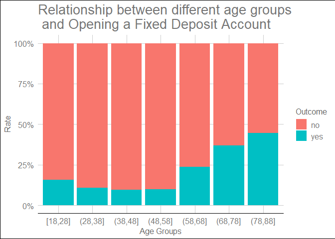<!-- -->

## Comparing Job to Outcome

``` r
## Creating a Positivity Ratio profile on the different occupation inn the dataset.
## The retired people comes first with confirms the question raised before about elderly people more interested in term deposit
## A simple Plot to show our Results
## Missing values are in this variable, "Unknown"
bank_df %>%
   select(job, y) %>%
   group_by(job) %>%
   count(y) %>%
   ungroup() %>%
   mutate(job = str_to_title(job)) %>%
   spread(key= y, value = n) %>%
   mutate(positivity_ratio = round((yes/(yes+no)),3)) %>%
   mutate(job = reorder(job, positivity_ratio)) %>%
   arrange(desc(positivity_ratio)) %>%
   ggplot(aes(positivity_ratio,job, col = job))+
   geom_point()+
   geom_segment(aes(xend = 0, x = positivity_ratio, y = job, yend = job))+
   labs(
      title = "Jobs and their Positivity Rates",
      subtitle = "The Positivity rate here is defined as the percentage of the people\n that subscribed to a term deposit",
      y = NULL,
      x = NULL
   )+
   scale_x_continuous(labels = scales::percent_format())+
   theme(
      legend.position = "none",
      axis.text.y = element_text(face = "bold.italic"),
      plot.subtitle = element_text(face = "italic")
   ) 
```

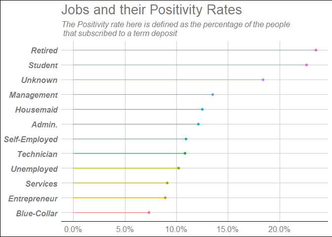<!-- -->

## Relationship between Marital Status and the Outcome.

``` r
## The Number of Single people in the dataset is twice the number of divorced people
## but 14.6% of the divorced set subscribed to a term deposit.

 bank_df %>%
   select(marital, y) %>%
   group_by(marital) %>%
   count(y)%>%
   spread(key = y, value = n) %>%
   mutate(total = yes+no,
      positivity_ratio = round((yes/total),3)) %>%
   arrange(desc(positivity_ratio)) %>%
   select(marital,total, positivity_ratio) %>%
   mutate(positivity_ratio = paste0(round(100*positivity_ratio,2),"% subscribed to a term deposit"))%>%
   data.frame()
```

    ##    marital total                   positivity_ratio
    ## 1 divorced   528 14.6% subscribed to a term deposit
    ## 2   single  1196   14% subscribed to a term deposit
    ## 3  married  2797  9.9% subscribed to a term deposit

## Relationship between Education and the Outcome.

``` r
## There are also missing values here, "unknown".
## Method of Imputation: knnImpute seems to be a better choice.
## We can see that tertiary education category has the highest positivity rate.
bank_df %>%
   select(education, y) %>%
   group_by(education) %>%
   count(y) %>%
   ungroup() %>%
   spread(key = y, value = n) %>%
   mutate(total = no + yes,
          p_rate =round((yes/total)*100,2)) %>%
   select(education,total,p_rate) %>%
   arrange(desc(p_rate))
```

    ## # A tibble: 4 x 3
    ##   education total p_rate
    ##   <fct>     <int>  <dbl>
    ## 1 tertiary   1350  14.3 
    ## 2 secondary  2306  10.6 
    ## 3 unknown     187  10.2 
    ## 4 primary     678   9.44

``` r
## Creating a function to produce postivity rate table

p_rate <- function(df,column_name){
   column_name <- enquo(column_name)
   
   df %>%
   select(!!column_name, y) %>%
   group_by(!!column_name) %>%
   count(y) %>%
   ungroup() %>%
   spread(key = y, value = n) %>%
   mutate(total = no + yes,
          p_rate =round((yes/total)*100,2)) %>%
   select(!!column_name,total,p_rate) %>%
   arrange(desc(p_rate))
}
   
p_rate(bank_df,education)
```

    ## # A tibble: 4 x 3
    ##   education total p_rate
    ##   <fct>     <int>  <dbl>
    ## 1 tertiary   1350  14.3 
    ## 2 secondary  2306  10.6 
    ## 3 unknown     187  10.2 
    ## 4 primary     678   9.44

## Relationship between Default and the Outcome.

``` r
## Well, whether a customer has credit in default or not doesn't really seem to affect the outcome
p_rate(bank_df,default)
```

    ## # A tibble: 2 x 3
    ##   default total p_rate
    ##   <fct>   <int>  <dbl>
    ## 1 yes        76   11.8
    ## 2 no       4445   11.5

## Relationship between Balance and the Outcome.

``` r
## Does it mean that someone who earns a negative amount is in debt?
bank_df %>%
   select(balance) %>%
   summary()
```

    ##     balance     
    ##  Min.   :-3313  
    ##  1st Qu.:   69  
    ##  Median :  444  
    ##  Mean   : 1423  
    ##  3rd Qu.: 1480  
    ##  Max.   :71188

``` r
## People that earn less than 10,000 Euros tends to subscribe to a term deposit? lets investigate further.
## Normalization is required.
bank_df %>%
   filter(balance > 0) %>%
   select(balance, y) %>%
   ggplot(aes(balance, fill = y)) +
   geom_histogram(show.legend = F)+
   labs(
      x = "Yearly average income"
   )+
   facet_wrap(y~., scales = "free")
```

    ## `stat_bin()` using `bins = 30`. Pick better value with `binwidth`.

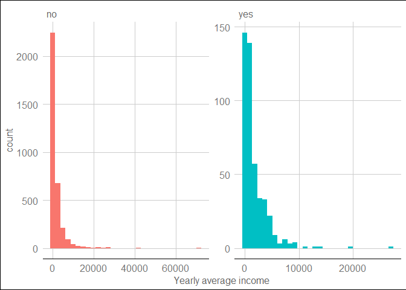<!-- -->

``` r
## People that earn above 10,000 Euros yearly, are more likely not to subscribe for a term deposit. 
bank_df %>%
   filter(balance >10000 ) %>%
   select(balance, y) %>%
     ggplot(aes(balance, fill = y)) +
   geom_histogram(show.legend = F)+
   labs(
      x = "Yearly average income"
   )+
   facet_wrap(y~., scales = "free")
```

    ## `stat_bin()` using `bins = 30`. Pick better value with `binwidth`.

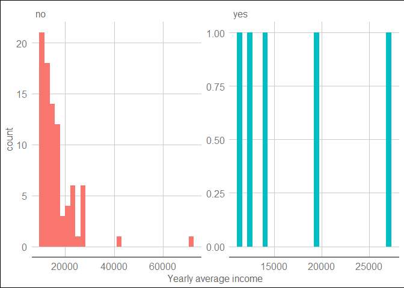<!-- -->

``` r
## Also,if one is in debt (negative income), chances are that he/she could subscribe for a term deposit
bank_df %>%
   filter(balance < 0 ) %>%
   select(balance, y) %>%
   ggplot(aes(balance, fill = y)) +
   geom_histogram(show.legend = F)+
   labs(
      x = "Yearly average income"
   )+
   facet_wrap(y~., scales = "free")
```

    ## `stat_bin()` using `bins = 30`. Pick better value with `binwidth`.

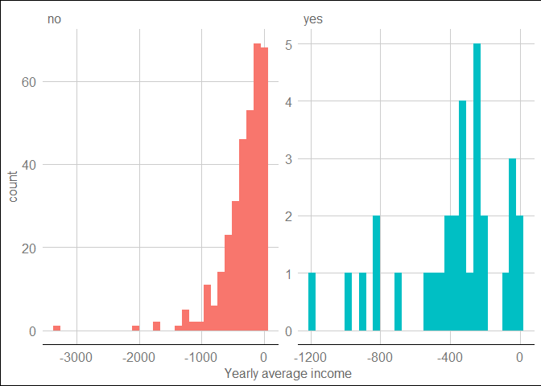<!-- -->

## Relationship between Housing Loan and the Outcome.

``` r
## People that don't havea housing loan are almost twice more likely to subscribe for a term deposit.
p_rate(bank_df,housing) 
```

    ## # A tibble: 2 x 3
    ##   housing total p_rate
    ##   <fct>   <int>  <dbl>
    ## 1 no       1962   15.3
    ## 2 yes      2559    8.6

## Relationship between Persnal Loan and the Outcome.

``` r
## People that don't have a personal loan are 2x more likely to subscribe for a term deposit.

p_rate(bank_df,loan)
```

    ## # A tibble: 2 x 3
    ##   loan  total p_rate
    ##   <fct> <int>  <dbl>
    ## 1 no     3830  12.5 
    ## 2 yes     691   6.22

## Relationship between Contact and the Outcome.

``` r
## There isn't much to differenciate them, although we have some missing values "unknown"

p_rate(bank_df, contact)
```

    ## # A tibble: 3 x 3
    ##   contact   total p_rate
    ##   <fct>     <int>  <dbl>
    ## 1 telephone   301  14.6 
    ## 2 cellular   2896  14.4 
    ## 3 unknown    1324   4.61

## Relationship between Days and Months and the Outcome.

``` r
## It seems normal
bank_df %>%
   select(day, y) %>%
   ggplot(aes(day, fill = y)) +
   geom_histogram(show.legend = F)+
   labs(
      x = "Last contact day of the month"
   )+
   facet_wrap(y~., scales = "free")
```

    ## `stat_bin()` using `bins = 30`. Pick better value with `binwidth`.

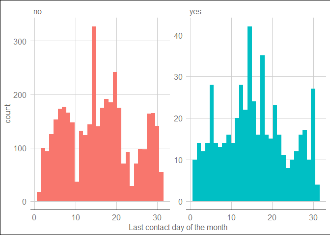<!-- -->

``` r
## thoughts: I would want to combine the month and day to figure out if that day was on a holiday
bank_df %>%
   select(month, y) %>%
   ggplot(aes(month, fill = y)) +
   geom_bar(stat = "count", show.legend = F)+
   labs(
      x = "Last contact month of the year"
   )
```

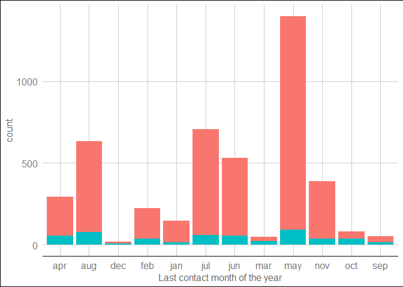<!-- -->

## Relationship between Call Duration and the Outcome.

``` r
## I have a crazy thought, i want to know if richer customers had a higher call duration
## Well, there doesn't seem to be any preferencial treatments here.
## People who spent more than 8 minutes on the phone were more likely to subscribe? Lets dig in.

options(scipen = 999)

bank_df %>%
   select(balance, duration, y) %>%
   mutate(duration = duration/60) %>%
   ggplot(aes(y = duration, x = balance, col = y)) +
   geom_point(alpha = 0.3)+
   geom_hline(yintercept = 8)+
   scale_y_log10()+
   scale_x_log10()+
     labs(
      y = "Call Duration in Minutes",
      x = "Yearly average income",
      col = "Outcome"
   ) 
```

    ## Warning in self$trans$transform(x): NaNs produced

    ## Warning: Transformation introduced infinite values in continuous x-axis

    ## Warning: Removed 366 rows containing missing values (geom_point).

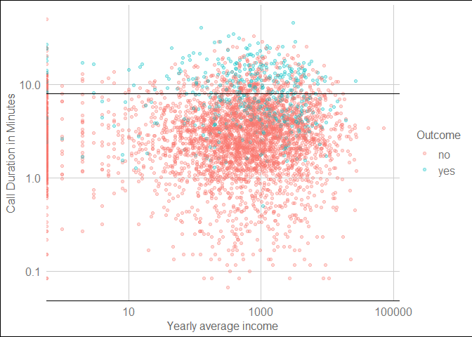<!-- -->

``` r
## People who spent more than 8 minutes on the phone were more likely to subscribe?
## Yes, this is true

bank_df %>%
   mutate(duration = duration/60) %>%
   mutate(test = ifelse(duration > 8,"More than 8 Minutes","Less than 8 Minutes")) %>%
   select(balance, duration, y, test) %>%
   ggplot(aes(y = duration, x = balance, col = y)) +
   geom_point(alpha = 0.6)+
   scale_y_log10()+
   scale_x_log10()+
   facet_wrap(~test, scales = "free")+
   labs(
      y = "Call Duration in Minutes",
      x = "Yearly average income",
      col = "Outcome"
   )+
   ggthemes::theme_fivethirtyeight()
```

    ## Warning in self$trans$transform(x): NaNs produced

    ## Warning: Transformation introduced infinite values in continuous x-axis

    ## Warning: Removed 366 rows containing missing values (geom_point).

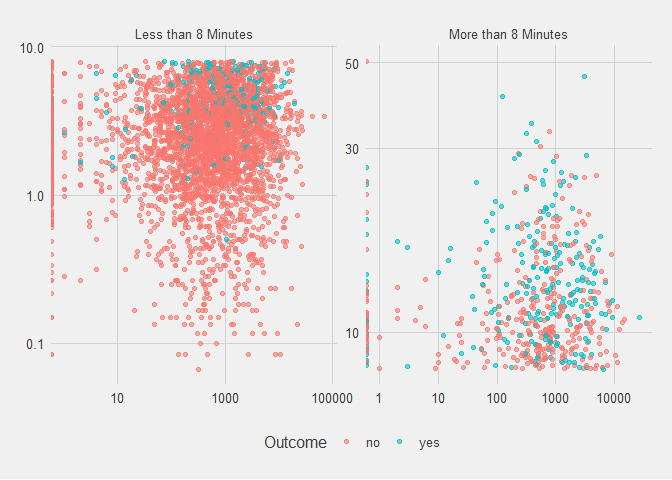<!-- -->

## Relationship between Campaign and the Outcome.

``` r
## People that subscribed didn't need to have too many campaigns
bank_df %>%
   select(campaign,y) %>%
   ggplot(aes(campaign, fill = y))+
   geom_boxplot()+
  # scale_x_log10()+
   coord_flip()
```

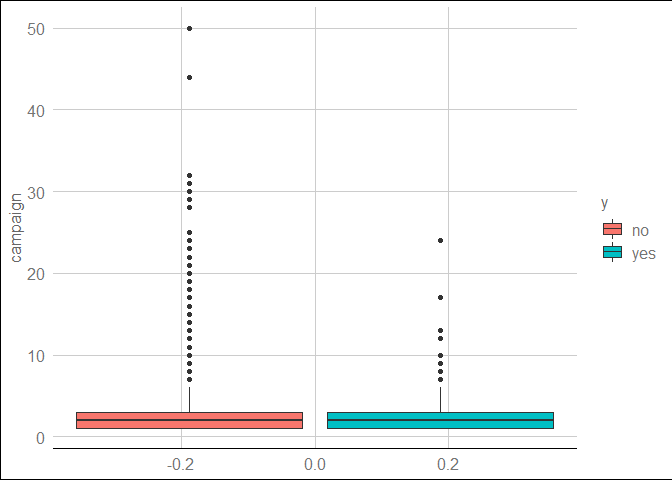<!-- -->

## Relationship between Pdays and the Outcome.

``` r
bank_df %>%
   select(pdays,y) %>%
   ggplot(aes(pdays, fill = y))+
   geom_boxplot()+
   scale_x_log10()+
   coord_flip()
```

    ## Warning in self$trans$transform(x): NaNs produced

    ## Warning: Transformation introduced infinite values in continuous x-axis

    ## Warning: Removed 3705 rows containing non-finite values (stat_boxplot).

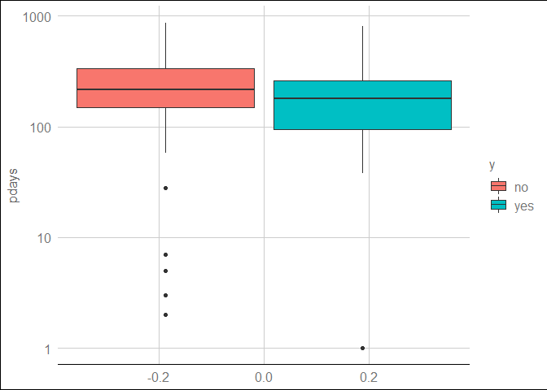<!-- -->

## Relationship between Previous and the Outcome.

``` r
bank_df %>%
   select(previous,y) %>%
   ggplot(aes(previous, fill = y))+
   geom_boxplot()+
   scale_x_log10()+
   coord_flip()
```

    ## Warning: Transformation introduced infinite values in continuous x-axis

    ## Warning: Removed 3705 rows containing non-finite values (stat_boxplot).

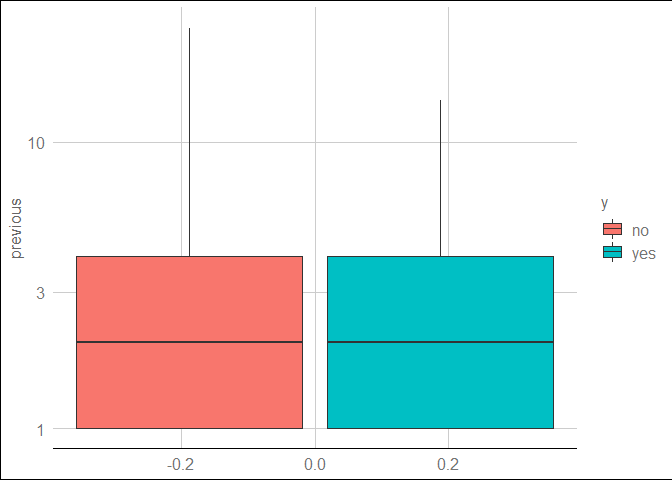<!-- -->

## Relationship between poutcome and the Outcome.

``` r
## alot of missing values, i think will remove this variable

p_rate(bank_df,poutcome)
```

    ## # A tibble: 4 x 3
    ##   poutcome total p_rate
    ##   <fct>    <int>  <dbl>
    ## 1 success    129   64.3
    ## 2 other      197   19.3
    ## 3 failure    490   12.9
    ## 4 unknown   3705    9.1

## Some thoughts and Feature Engineering

Somme of the strong indicators here are that

<ul>

<li>

Older People are more likely to subscribe

</li>

<li>

Retired people and students have a high positivity rate compared to
others

</li>

<li>

The Divorced show a high rate too, but should that really be considered?

</li>

<li>

People that earn above 10,000 Euros yearly are less likely to subscribe

</li>

<li>

People that had a call duration of 8 minutes and higher were more likely
to subscribe

</li>

<li>

People that were going to subscribe didn’t have to recieve many
campaigns

</li>

</ul>

Lets create a new variable containing most of our strong variables and
test on the outcome

``` r
## By creating a check list to get people who are either students or retired 
## who earn less than 10,000 Euros yearly and recieved a call that lasted for more than 8 Minutes, 
## the postivity rate is 47.83% from a total of 46 people.
bank_df %>%
   mutate(duration = duration/60,
          test = ifelse(job %in% c("student","retired") & balance < 10000 & duration > 8,
                        "They have the strong Variables","They dont have it")) %>%
   p_rate(test)
```

    ## # A tibble: 2 x 3
    ##   test                           total p_rate
    ##   <chr>                          <int>  <dbl>
    ## 1 They have the strong Variables    46   47.8
    ## 2 They dont have it               4475   11.2

Well, that is all for now. I was able to really understand the dataset
and when ML algorithms are applied i can get a better understanding.

``` r
bank_df %>%
   mutate(education = as.character(education),
          job = as.character(job),
          job = ifelse(job == "unknown",NA,job),
          education = ifelse(education == "unknown",NA,education)) %>%
   write_csv("bank_ML.csv")
   
## For Contact we will create a new variable to test for unknown
```
